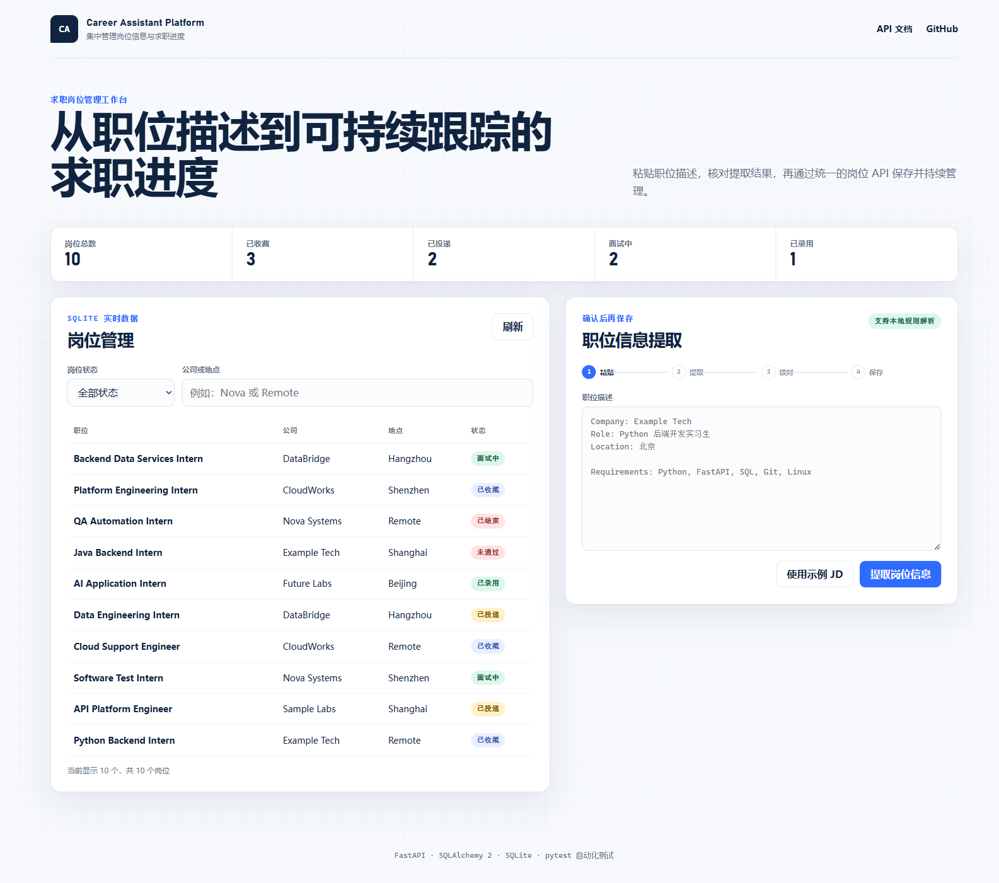
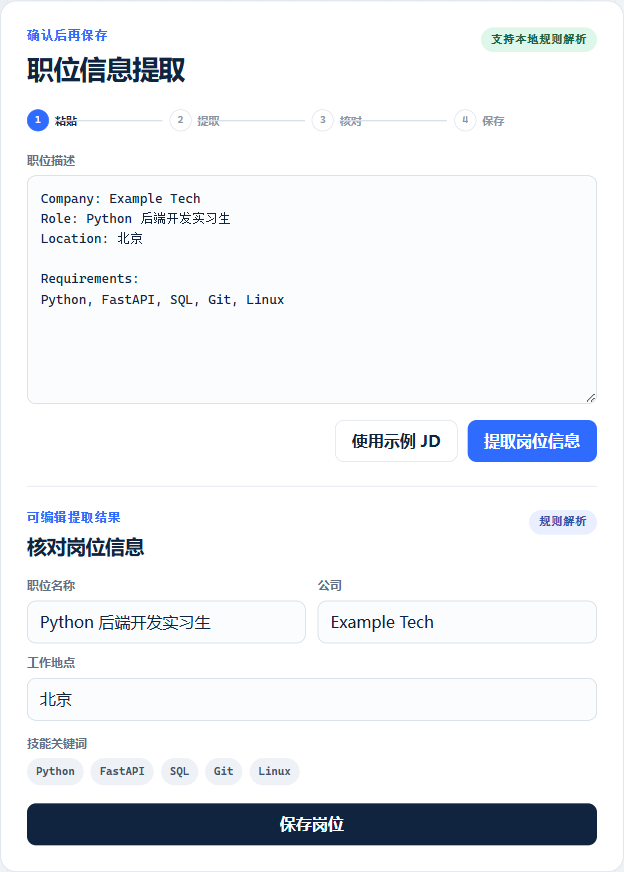
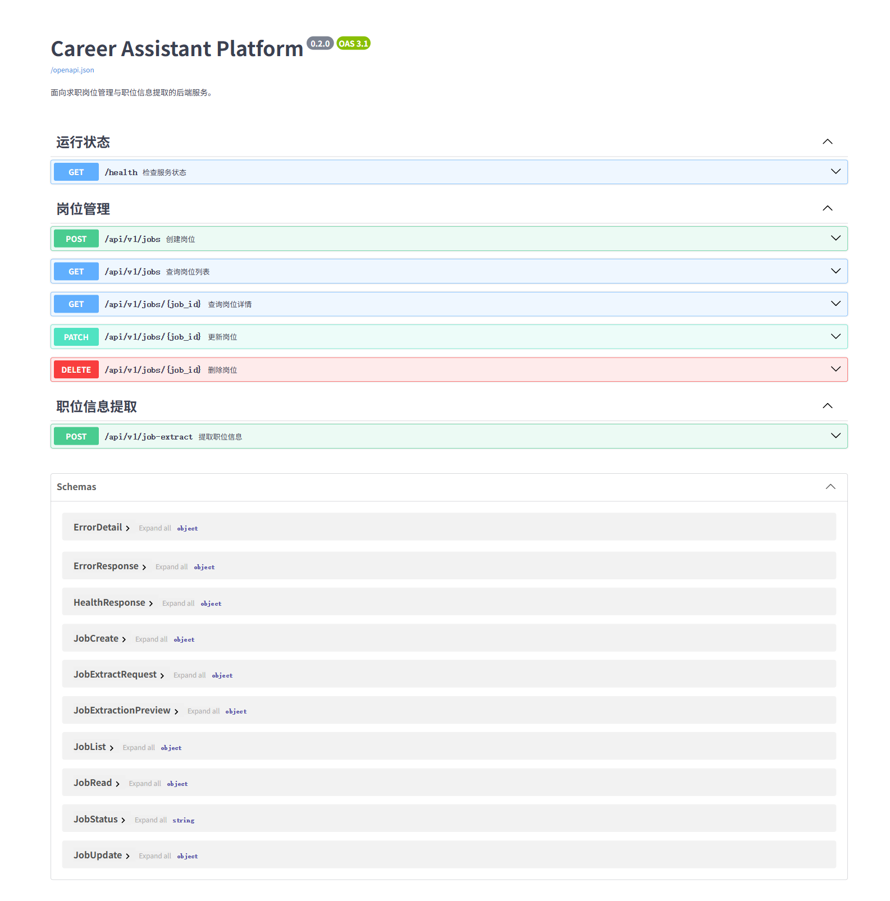
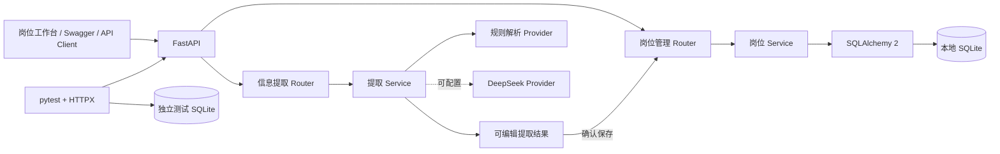
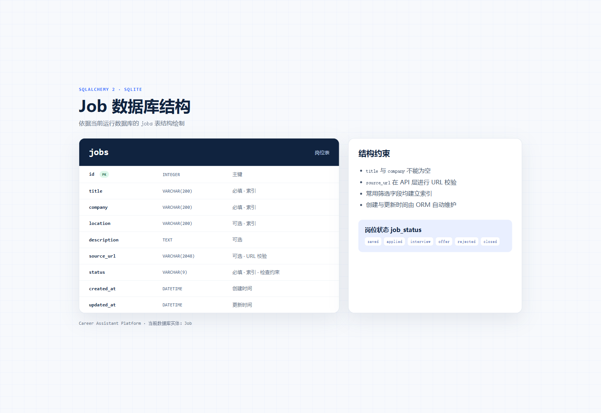
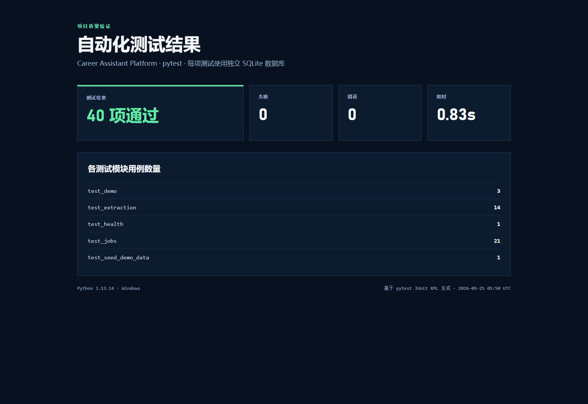
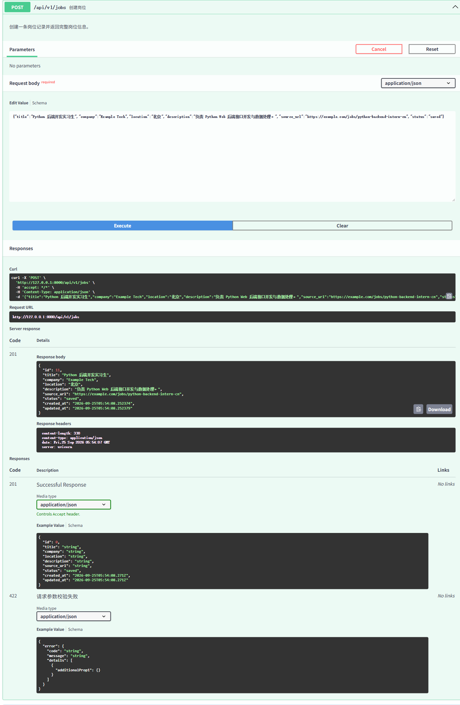

# Career Assistant Platform

基于 FastAPI 与 SQLAlchemy 构建的求职岗位管理与职位信息提取平台，支持岗位生命周期管理、多条件检索、JD 信息提取和自动化测试。

## 项目简介

求职过程中，岗位链接、职位描述、投递状态和面试进度往往分散在不同平台与文档中。Career Assistant Platform 提供统一的岗位数据管理与信息提取能力，用于记录岗位、筛选岗位、跟踪状态，并快速整理职位描述中的关键信息。

项目以后端工程能力为核心：使用清晰的 REST API 管理数据，通过 SQLAlchemy 完成持久化，以 Pydantic 约束输入输出，并使用独立测试数据库验证接口行为。浏览器工作台直接调用同一套 API，不维护重复的业务逻辑。

## 核心功能

### 岗位管理

- 岗位新增、列表查询、详情查询、局部更新和删除
- `saved`、`applied`、`interview`、`offer`、`rejected`、`closed` 六阶段状态管理
- 按公司、状态和地点筛选
- 分页查询与最大分页容量限制
- 职位名称、公司、URL、状态和查询参数校验
- 统一的 `404` 与 `422` 错误响应结构

### 职位信息提取

- 粘贴 JD 文本，提取职位名称、公司、地点和技能关键词
- 提取结果可编辑，确认后通过 Job API 保存
- 规则解析无需外部模型服务即可运行
- 支持可配置的 DeepSeek Provider，并保留规则解析作为基础提取方案
- 外部 Provider 不可用时自动切换至规则解析，并在响应中标记实际提取方式

### 数据与质量保障

- SQLAlchemy 2.x 持久化和环境变量数据库配置
- 10 条内置示例岗位数据，初始化脚本可重复执行
- 40 项 pytest 自动化测试
- 每项接口测试使用独立 SQLite 数据库，避免测试数据相互影响

## 系统工作台

启动服务后访问 [http://127.0.0.1:8000/demo](http://127.0.0.1:8000/demo)。工作台展示岗位统计、状态筛选、公司或地点检索、岗位列表，以及“粘贴 JD → 提取 → 核对 → 保存”的完整流程。



## 职位信息提取

默认配置在未启用外部模型服务时使用规则解析。配置 `DEEPSEEK_API_KEY` 后，系统可调用 DeepSeek Provider；网络异常、限流或响应格式异常时，提取服务会按既定策略切换到规则解析。职位提取接口只生成预览，不会直接写入数据库。



示例请求：

```bash
curl -X POST http://127.0.0.1:8000/api/v1/job-extract \
  -H "Content-Type: application/json" \
  -d '{"text":"Company: Example Tech\nRole: Python 后端开发实习生\nLocation: 北京\nRequirements: Python, FastAPI, SQL"}'
```

## API 接口

Swagger UI 地址：[http://127.0.0.1:8000/docs](http://127.0.0.1:8000/docs)。

| 方法 | 路径 | 功能 |
|---|---|---|
| `GET` | `/health` | 检查服务状态 |
| `POST` | `/api/v1/jobs` | 创建岗位 |
| `GET` | `/api/v1/jobs` | 分页查询并筛选岗位 |
| `GET` | `/api/v1/jobs/{job_id}` | 查询岗位详情 |
| `PATCH` | `/api/v1/jobs/{job_id}` | 更新指定岗位字段 |
| `DELETE` | `/api/v1/jobs/{job_id}` | 删除岗位 |
| `POST` | `/api/v1/job-extract` | 提取职位信息预览 |



## 系统架构



详细边界和请求流程见[系统架构说明](docs/architecture/current-architecture.md)。

## 数据模型

当前数据模型聚焦 `jobs` 表。`title` 和 `company` 为必填字段；`location`、`description` 和经过 URL 校验的 `source_url` 为可选字段。`status` 由数据库约束限定为六种状态。



字段、索引、约束与状态设计见[数据库结构说明](docs/architecture/database-schema.md)。

## 技术栈

- Python 3.13
- FastAPI、Uvicorn
- SQLAlchemy 2.x
- Pydantic 2、pydantic-settings
- SQLite
- pytest、HTTPX、AnyIO
- HTML、CSS、Vanilla JavaScript

数据库访问层通过 `DATABASE_URL` 管理连接。当前本地运行默认采用 SQLite，数据库层可进一步扩展至 MySQL 等关系型数据库。

## 自动化测试

项目使用 pytest、HTTPX 和独立测试数据库构建接口测试体系，覆盖：

- 岗位 CRUD
- 输入校验
- 分页和筛选
- `404` / `422` 异常处理
- 示例数据初始化与幂等性
- 职位信息提取
- Provider 切换与异常处理

```bash
python -m pytest -v
```

当前测试结果：**40 passed**。



## 快速开始

```bash
git clone https://github.com/xuyang2005cs/career-assistant-platform.git
cd career-assistant-platform
python -m venv .venv
```

Windows PowerShell：

```powershell
.\.venv\Scripts\Activate.ps1
python -m pip install -r requirements.txt
Copy-Item .env.example .env  # 可选，本地 .env 不进入 Git
```

初始化数据库、写入示例岗位并启动服务：

```powershell
python -m scripts.seed_demo_data
python -m uvicorn app.main:app --reload
```

`seed_demo_data` 以职位名称与公司为去重条件，可安全重复执行。

## API 示例

查询北京地区已收藏岗位：

```text
GET /api/v1/jobs?page=1&page_size=5&status=saved&location=Beijing
```

创建岗位：

```json
{
  "title": "Python 后端开发实习生",
  "company": "Example Tech",
  "location": "北京",
  "description": "负责 Python Web 后端接口开发与数据处理。",
  "source_url": "https://example.com/jobs/python-backend-intern",
  "status": "saved"
}
```



## 项目结构

```text
app/
├── api/                 # 运行状态、岗位、信息提取和工作台路由
├── core/                # 配置、数据库生命周期和异常处理
├── models/              # SQLAlchemy Job 模型
├── schemas/             # Pydantic API 数据契约
├── services/
│   ├── extraction/      # 规则解析、DeepSeek Provider 和服务编排
│   └── job_service.py
├── static/              # 岗位工作台静态资源
└── main.py
docs/
├── architecture/        # 架构与数据库说明
├── development/         # 开发记录、决策与问题排查
├── images/              # 项目运行截图
└── research/            # 开源项目调研
scripts/                 # 数据初始化与测试结果渲染工具
tests/                   # 接口与 Provider 测试
```

## 技术设计

- 聚焦单一 Job 领域，先完成可运行、可测试的完整业务闭环
- ORM 模型与 API Schema 分离，避免数据库实现直接成为接口契约
- 职位提取与数据保存分离，用户确认后才创建岗位
- 规则解析作为稳定基础能力，外部模型 Provider 通过配置启用
- Service 层直接使用请求级 SQLAlchemy Session，避免当前规模下的多层重复抽象
- 当前使用 `Base.metadata.create_all()` 初始化单表结构，后续随 Schema 演进引入 Alembic

## 开发文档

- [系统架构说明](docs/architecture/current-architecture.md)
- [数据库结构说明](docs/architecture/database-schema.md)
- [岗位管理与信息提取开发记录](docs/development/phase-02-completion.md)
- [API 验收记录](docs/development/api-acceptance-phase-02.md)
- [问题排查记录](docs/development/issue-log.md)
- [开源项目参考](docs/research/open-source-reference.md)

## 后续扩展

- 投递记录管理，以及 Application 与 Job 的关联
- 面试流程与进度记录
- Alembic 数据库迁移管理
- MySQL 部署配置
- 用户认证与数据权限
- 模型辅助岗位分析
- CI、部署与可观测性

## License

本项目采用 [MIT License](LICENSE)。
