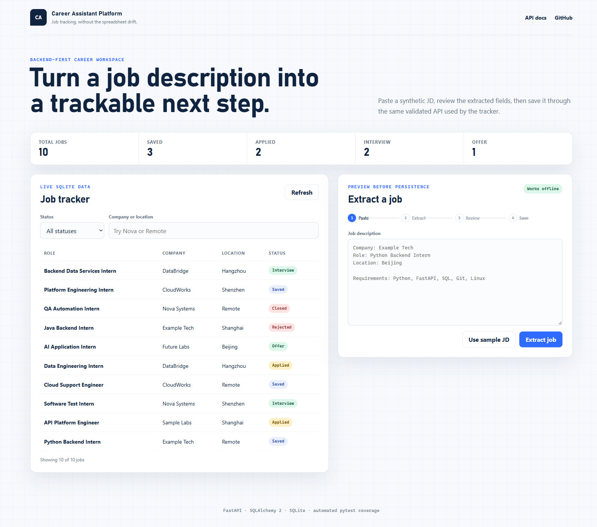
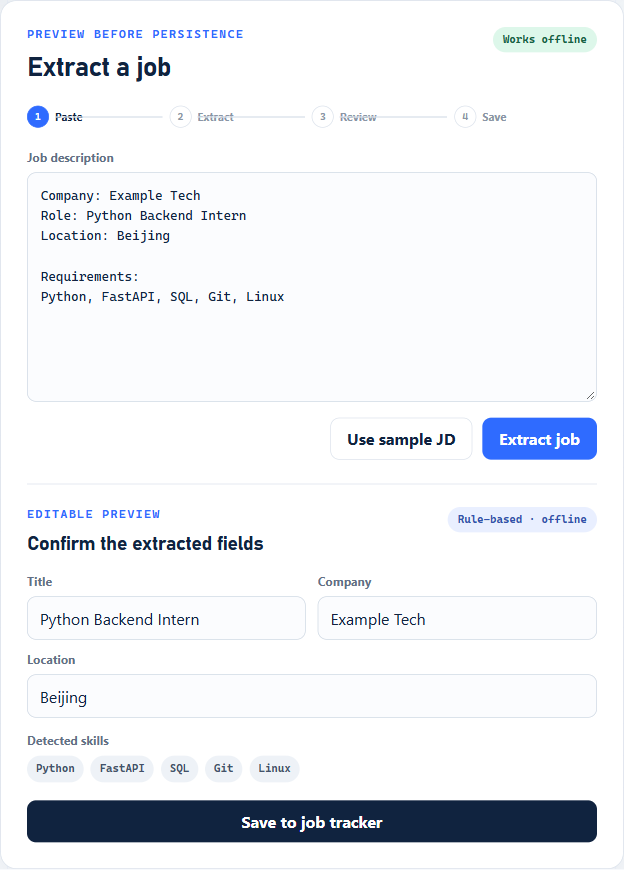
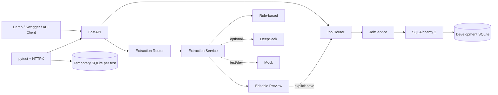

# Career Assistant Platform

Backend-first career tracking and job-analysis platform built with FastAPI, SQLAlchemy, and automated testing.

## Overview

Career Assistant Platform turns a pasted job description into an editable preview, then lets the user explicitly save and track that opportunity through a six-state lifecycle. The current release is a focused Phase 2 backend slice with a small, real browser demo—not a mockup of a future product.

## Why This Project

Job research and application state often drift across spreadsheets, bookmarks, and notes. This project establishes a reliable data and API foundation while demonstrating practical backend engineering: explicit contracts, persistence, isolated tests, graceful provider fallback, and evidence tied to running code.

## Features

### Implemented

- Job create, list, get, patch, and delete REST operations
- SQLAlchemy 2.x persistence and environment-driven database configuration
- Six states: `saved`, `applied`, `interview`, `offer`, `rejected`, `closed`
- Pagination and company, status, and location filters
- Pydantic validation for blank fields, URLs, statuses, and query bounds
- Consistent `404` and `422` error envelopes
- Idempotent seed command with 10 fictional Jobs
- Lightweight `/demo` tracker using the existing API
- Preview-only JD extraction with editable fields and detected skills
- Always-available rule-based extraction
- Optional DeepSeek provider with classified failures and truthful rule fallback
- Explicit mock provider for tests/development
- 40 isolated automated tests

### Planned

- MySQL runtime verification and an intentional production database setup
- Alembic migrations when the schema begins evolving
- Application and interview workflow entities
- Authentication, deployment, and observability

No RAG, agent, MCP, vector database, or automated application submission is implemented.

## Demo

Run the server and open [http://127.0.0.1:8000/demo](http://127.0.0.1:8000/demo). The page loads the live development database, filters Jobs, extracts a pasted JD, and saves only after confirmation.



## API

Swagger UI is available at [http://127.0.0.1:8000/docs](http://127.0.0.1:8000/docs).

| Method | Path | Purpose |
|---|---|---|
| `GET` | `/health` | Readiness check |
| `POST` | `/api/v1/jobs` | Create a Job |
| `GET` | `/api/v1/jobs` | List, paginate, and filter Jobs |
| `GET` | `/api/v1/jobs/{job_id}` | Get one Job |
| `PATCH` | `/api/v1/jobs/{job_id}` | Update supplied fields |
| `DELETE` | `/api/v1/jobs/{job_id}` | Delete a Job |
| `POST` | `/api/v1/job-extract` | Produce an extraction preview without saving |


## Job Extraction

The default `auto` configuration uses DeepSeek only when `DEEPSEEK_API_KEY` is deliberately configured; otherwise it uses the deterministic rule-based provider. The mock provider is limited to test/development and always identifies itself as `mock`.

If a configured DeepSeek request fails, the response is labeled `rule_based_fallback` and includes a safe reason code. It is never presented as model success. DeepSeek was **not real-call verified** in this phase because no API key was present. HTTP success, `401`, `429`, `5xx`, timeout, and malformed-response behavior are tested with mock transports.



Example request:

```bash
curl -X POST http://127.0.0.1:8000/api/v1/job-extract \
  -H "Content-Type: application/json" \
  -d '{"text":"Company: Example Tech\nRole: Python Backend Intern\nLocation: Beijing\nRequirements: Python, FastAPI, SQL"}'
```

## Architecture



See [Current Architecture](docs/architecture/current-architecture.md) for boundaries and request flows.

## Data Model

Only the real `jobs` table is modeled. `title` and `company` are required; optional description, location, and validated source URL fields keep the MVP useful without adding unrelated entities.


See [Database Schema](docs/architecture/database-schema.md) for fields, constraints, enum decisions, and verified SQLite DDL.

## Tech Stack

- Python 3.13
- FastAPI and Uvicorn
- SQLAlchemy 2.x
- Pydantic 2 and pydantic-settings
- SQLite for verified local development
- pytest, HTTPX, and AnyIO for integration tests
- Plain HTML, CSS, and JavaScript for the demo

MySQL was unavailable on the Phase 2 machine and has not been verified. `DATABASE_URL` provides a clean future switch point, but “configuration-ready” is not a claim of working MySQL integration.

## Testing

```bash
python -m pytest -v
```

The suite contains 40 tests. Each API case receives a fresh temporary SQLite file through a FastAPI dependency override; tests never access the development database. DeepSeek tests use HTTPX mock transports and make no external request.


## Getting Started

```bash
git clone https://github.com/xuyang2005cs/career-assistant-platform.git
cd career-assistant-platform
python -m venv .venv
```

Activate the environment on Windows PowerShell and install dependencies:

```powershell
.\.venv\Scripts\Activate.ps1
python -m pip install -r requirements.txt
Copy-Item .env.example .env  # optional; .env is ignored
```

Create the SQLite schema, load safe demo data, and start the application:

```powershell
python -m scripts.seed_demo_data
python -m uvicorn app.main:app --reload
```

The seed command is idempotent on title + company. All bundled records and screenshots use fictional data.

## API Examples

List the second page of saved roles in Beijing:

```text
GET /api/v1/jobs?page=2&page_size=5&status=saved&location=Beijing
```

Create a confirmed preview as a Job:

```json
{
  "title": "Python Backend Intern",
  "company": "Example Tech",
  "location": "Beijing",
  "description": "Synthetic portfolio sample.",
  "source_url": "https://example.com/jobs/python-backend-intern",
  "status": "saved"
}
```


## Project Structure

```text
app/
├── api/                 # health, Job, extraction, and demo routes
├── core/                # settings, database lifecycle, error handling
├── models/              # SQLAlchemy Job model
├── schemas/             # API contracts
├── services/
│   ├── extraction/      # rule-based, DeepSeek, mock, orchestration
│   └── job_service.py
├── static/              # framework-light demo
└── main.py
docs/
├── architecture/
├── development/
├── images/
└── research/
scripts/                 # idempotent seed and evidence renderer
tests/                   # isolated integration and provider tests
```

## Engineering Decisions

- One entity first: a complete Job vertical slice is easier to explain and verify than several incomplete domains.
- Explicit schemas: ORM objects are not request contracts.
- Preview before persistence: extraction never silently writes a Job.
- Offline baseline: the product remains useful without an API key.
- Honest provider metadata: `rule_based`, `rule_based_fallback`, `deepseek`, and `mock` are distinguishable.
- Simple schema lifecycle: `create_all()` is sufficient until real migrations exist.

## Development Notes

- [Phase 2 Completion Log](docs/development/phase-02-completion.md)
- [API Acceptance Evidence](docs/development/api-acceptance-phase-02.md)
- [Issue Log](docs/development/issue-log.md)
- [Open-source Reference Review](docs/research/open-source-reference.md)

## Roadmap

- [x] Phase 1: repository foundation and health endpoint
- [x] Phase 2: Job CRUD, persistence, isolated tests, demo, and extraction preview
- [ ] Phase 3: define the next domain deliberately; add migrations when required
- [ ] Verify MySQL in a controlled environment
- [ ] Verify optional DeepSeek with a user-provided key and synthetic input

Roadmap items are plans, not claims of completed behavior.

## License

This project is licensed under the [MIT License](LICENSE).
