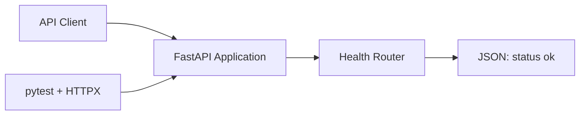

# Career Assistant Platform

Career Assistant Platform is a backend foundation for a practical, extensible job-search assistant. The project is being developed as a production-minded portfolio project: each capability will be implemented, tested, and documented before it is presented as complete.

## Motivation

Job seekers often spread role research, application tracking, document preparation, and interview notes across disconnected tools. This project aims to bring those workflows together behind a clear API while demonstrating maintainable backend engineering and honest, verifiable delivery.

## Current Features

- FastAPI application with generated OpenAPI documentation
- `GET /health` readiness endpoint
- Automated API test using pytest and HTTPX ASGI transport
- Environment template and repository security defaults
- Architecture and development decision records

## Planned Features

The following capabilities are **planned / coming soon** and are not implemented yet:

- Job and application management
- SQLAlchemy persistence with MySQL
- AI-assisted job description analysis
- Retrieval-augmented generation (RAG)
- Tool calling and workflow automation
- Expanded unit, integration, and end-to-end test coverage

## Tech Stack

- Python 3.13
- FastAPI
- Uvicorn
- pytest
- HTTPX

SQLAlchemy, MySQL, and AI-related components are planned for later phases.

## Project Structure

```text
career-assistant-platform/
├── app/
│   ├── api/          # HTTP endpoints
│   ├── core/         # Shared configuration and utilities
│   ├── models/       # Planned domain and persistence models
│   ├── schemas/      # Planned request and response schemas
│   ├── services/     # Planned application services
│   └── main.py       # FastAPI application entry point
├── docs/
│   ├── architecture/
│   ├── development/
│   └── images/
├── scripts/
├── tests/
├── .env.example
├── .gitignore
├── LICENSE
└── requirements.txt
```

## Getting Started

1. Clone the repository and enter it:

   ```bash
   git clone https://github.com/xuyang2005cs/career-assistant-platform.git
   cd career-assistant-platform
   ```

2. Create and activate a virtual environment:

   ```bash
   python -m venv .venv
   ```

   On Windows PowerShell:

   ```powershell
   .\.venv\Scripts\Activate.ps1
   ```

   On macOS or Linux:

   ```bash
   source .venv/bin/activate
   ```

3. Install dependencies:

   ```bash
   python -m pip install -r requirements.txt
   ```

4. Start the API:

   ```bash
   python -m uvicorn app.main:app --reload
   ```

5. Open `http://127.0.0.1:8000/docs` for Swagger UI or request `http://127.0.0.1:8000/health`.

## Running Tests

```bash
python -m pytest -v
```

The current test suite verifies the status code and JSON contract of the health endpoint.

## Architecture



The current design intentionally contains only the components needed by the running application. See [Current Architecture](docs/architecture/current-architecture.md) for boundaries and future integration points.

## Screenshots

Verified screenshots will be stored in [`docs/images`](docs/images/README.md) as features are implemented. No placeholder or fabricated product screenshots are included.

Planned evidence includes Swagger UI, pytest output, the application workflow, the database ER diagram, test reporting, and AI evaluation results.

## Roadmap

- [x] Phase 1: repository foundation, health endpoint, tests, and documentation
- [ ] Phase 2: define the job/application domain and persistence design
- [ ] Phase 3: implement database-backed workflows
- [ ] Phase 4: add AI job analysis with measurable evaluation
- [ ] Phase 5: expand automation, observability, and deployment readiness

Roadmap items are plans, not claims of completed functionality.

## License

This project is licensed under the [MIT License](LICENSE).
