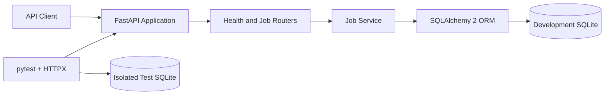

# Career Assistant Platform

Career Assistant Platform is a production-minded backend for organizing a job search. It currently provides a validated, database-backed Job REST API and is developed as a long-term portfolio project: capabilities are implemented, tested, and documented before they are presented as complete.

## Motivation

Job seekers often spread role research, application tracking, and interview notes across disconnected tools. This project is building a clear API foundation for those workflows while demonstrating maintainable backend design, automated verification, and honest delivery evidence.

## Current Features

- FastAPI application with generated OpenAPI 3.1 documentation
- Versioned Job CRUD API under `/api/v1/jobs`
- SQLAlchemy 2.0 persistence with an environment-driven database URL
- Pagination plus exact, case-insensitive company and location filters
- Status filtering across `saved`, `applied`, `interview`, `offer`, `rejected`, and `closed`
- Separate Pydantic create, update, read, list, and error contracts
- Consistent JSON responses for validation errors and missing jobs
- `GET /health` readiness endpoint
- 17 isolated pytest integration tests using temporary SQLite databases
- Architecture, database design, API acceptance, and issue documentation

## Planned Features

The following capabilities are **planned / coming soon** and are not implemented yet:

- Application and interview workflow entities
- Alembic-managed schema migrations
- Verified MySQL development/deployment integration
- AI-assisted job description analysis
- Retrieval-augmented generation (RAG)
- Tool calling and workflow automation
- Deployment and observability configuration

## Tech Stack

- Python 3.13
- FastAPI and Uvicorn
- SQLAlchemy 2.x
- Pydantic 2 and pydantic-settings
- SQLite for the currently verified local development flow
- pytest, HTTPX, and AnyIO for isolated API integration tests

MySQL was not available on the Phase 2 development machine and has **not** been verified. The application reads `DATABASE_URL` from the environment and is configuration-ready for another SQLAlchemy database URL once the appropriate driver and database environment are deliberately added.

## Project Structure

```text
career-assistant-platform/
├── app/
│   ├── api/          # Health and Job HTTP routes
│   ├── core/         # Settings, database lifecycle, and error handling
│   ├── models/       # SQLAlchemy ORM models
│   ├── schemas/      # Pydantic API contracts
│   ├── services/     # Job business operations
│   └── main.py       # FastAPI composition and lifespan
├── docs/
│   ├── architecture/ # Current architecture and database schema
│   ├── development/  # Setup, phase logs, decisions, issues, acceptance
│   └── images/       # Evidence captured from the running project
├── scripts/
├── tests/            # Isolated SQLite integration tests
├── .env.example
├── .gitignore
├── LICENSE
└── requirements.txt
```

## Getting Started

1. Clone the repository and enter it:

   ```bash
   git clone https://github.com/xuyang2005cs/career-assistant-platform.git
   cd career-assistant-platform
   ```

2. Create and activate a virtual environment:

   ```bash
   python -m venv .venv
   ```

   On Windows PowerShell:

   ```powershell
   .\.venv\Scripts\Activate.ps1
   ```

   On macOS or Linux:

   ```bash
   source .venv/bin/activate
   ```

3. Install dependencies:

   ```bash
   python -m pip install -r requirements.txt
   ```

4. Optionally create local settings and keep them uncommitted:

   ```powershell
   Copy-Item .env.example .env
   ```

   Without a local `.env`, the safe default is `sqlite:///./career_assistant.db`.

5. Start the API:

   ```bash
   python -m uvicorn app.main:app --reload
   ```

6. Open `http://127.0.0.1:8000/docs` for Swagger UI. Health is available at `http://127.0.0.1:8000/health`.

## API Overview

| Method | Path | Purpose |
|---|---|---|
| `POST` | `/api/v1/jobs` | Create a job |
| `GET` | `/api/v1/jobs` | List, paginate, and filter jobs |
| `GET` | `/api/v1/jobs/{job_id}` | Get one job |
| `PATCH` | `/api/v1/jobs/{job_id}` | Partially update a job |
| `DELETE` | `/api/v1/jobs/{job_id}` | Delete a job |

List query parameters are `page`, `page_size` (maximum 100), `company`, `status`, and `location`.

## Running Tests

```bash
python -m pytest -v
```

The current suite contains 17 tests. Every case receives a fresh temporary SQLite file through a FastAPI dependency override; tests never use the local development database.

## Architecture



See [Current Architecture](docs/architecture/current-architecture.md) and [Database Schema](docs/architecture/database-schema.md) for the implemented boundaries and constraints.

## Screenshots

All screenshots below were captured from the running Phase 2 application using synthetic data.

### Swagger Job API


### Job API Example


### Database Schema


## Database Status

- Local development: SQLite, verified with real CRUD and filter requests
- Automated tests: a separate temporary SQLite database per test, verified
- MySQL: not available on the Phase 2 machine and not verified
- Schema lifecycle: `Base.metadata.create_all()` for the current single-table MVP; Alembic is planned when migrations become necessary

## Roadmap

- [x] Phase 1: repository foundation, health endpoint, tests, and documentation
- [x] Phase 2: Job CRUD, SQLAlchemy persistence, filtering, validation, evidence, and isolated tests
- [ ] Phase 3: expand the application workflow and introduce intentional migration/deployment design
- [ ] Phase 4: add AI job analysis with measurable evaluation
- [ ] Phase 5: expand automation, observability, and deployment readiness

Roadmap items are plans, not claims of completed functionality.

## License

This project is licensed under the [MIT License](LICENSE).
