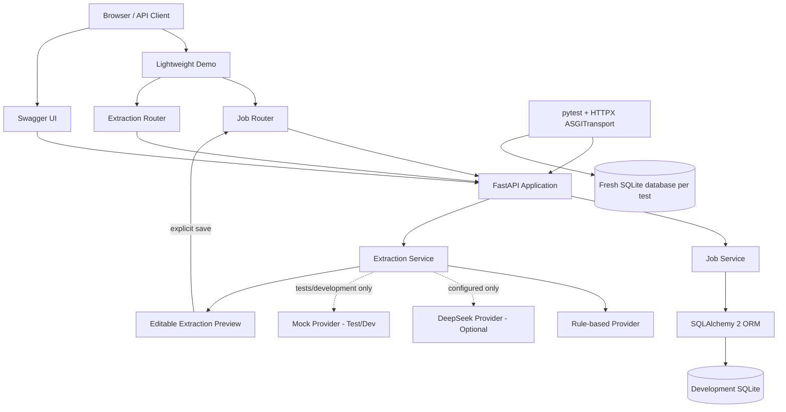

# Current Architecture

## Scope

Phase 2 implements one persisted domain entity, `Job`, plus a preview-only job-description extraction boundary. There are no user, resume, application, interview, vector, agent, or authentication tables.

## Request Flows

### Job persistence

1. FastAPI validates path, query, and body data against Pydantic contracts.
2. The Job router passes a request-scoped SQLAlchemy session to the service layer.
3. The service performs CRUD, filtering, ordering, and pagination with SQLAlchemy 2.x statements.
4. ORM entities are converted to explicit response schemas.
5. Domain not-found exceptions and validation failures use one error envelope.

### Job-description extraction

1. `POST /api/v1/job-extract` validates a non-blank input of at most 20,000 characters.
2. `ExtractionService` chooses the configured provider. With the safe default and no API key, it uses deterministic rule-based extraction.
3. DeepSeek failures are classified and may fall back to rules. The response then says `rule_based_fallback`; it never claims model success.
4. The result is a preview and does not touch the database. A user must explicitly save through `POST /api/v1/jobs`.

## Design Boundaries

- `app/main.py` composes routers, static assets, error handling, and database startup.
- `app/api/` owns HTTP semantics; `/demo` consumes the same public API rather than bypassing it.
- `app/services/job_service.py` owns Job persistence without extra repository/DAO layers.
- `app/services/extraction/` contains the rule-based, optional DeepSeek, and test/development mock providers.
- `app/models/job.py` is the only SQLAlchemy entity.
- `app/schemas/` keeps API contracts separate from ORM models.
- `tests/conftest.py` replaces the runtime database dependency with a new temporary SQLite database for every test.

## Database Portability Boundary

The engine is created from `DATABASE_URL`. SQLite receives only its required `check_same_thread=False` option; other SQLAlchemy URLs do not. MySQL still requires a selected driver, a running database, and real verification before it can be claimed as supported.
