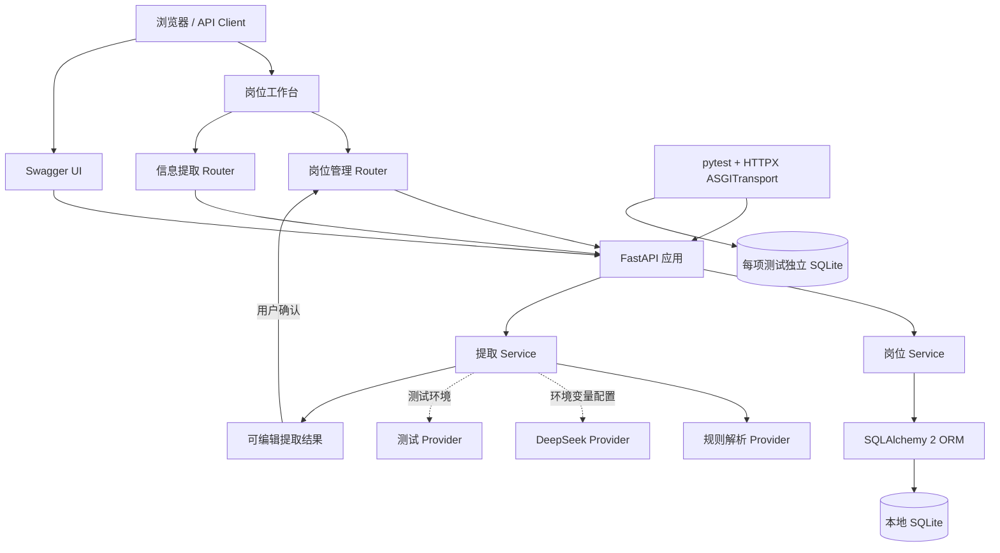

# 当前系统架构

## 系统范围

当前系统以 `Job` 为核心持久化实体，并提供职位描述信息提取能力。岗位管理和信息提取通过独立 Router 与 Service 组织；浏览器工作台与 Swagger 均复用公开 API。

## 请求流程

### 岗位数据持久化

1. FastAPI 使用 Pydantic Schema 校验路径、查询参数和请求体。
2. 岗位 Router 将请求级 SQLAlchemy Session 传递给 Service 层。
3. Service 使用 SQLAlchemy 2.x Statement 完成 CRUD、筛选、排序和分页。
4. ORM 实体通过独立的响应 Schema 输出。
5. 资源不存在与请求校验错误统一使用 `ErrorResponse`。

### 职位信息提取

1. `POST /api/v1/job-extract` 校验非空且不超过 20,000 字符的职位描述。
2. `ExtractionService` 根据环境配置选择 Provider；默认配置使用规则解析。
3. DeepSeek Provider 对鉴权、限流、服务端错误、网络异常和响应格式异常进行分类处理，并可切换到规则解析。
4. 接口只返回提取预览，不写入数据库；用户确认后再调用 `POST /api/v1/jobs` 保存。

## 模块边界

- `app/main.py`：组合 Router、静态资源、异常处理和数据库启动流程。
- `app/api/`：负责 HTTP 语义、参数约束和响应状态码。
- `app/services/job_service.py`：负责岗位 CRUD、筛选和分页。
- `app/services/extraction/`：负责 Provider 实现与提取流程编排。
- `app/models/job.py`：定义当前唯一的 SQLAlchemy 实体。
- `app/schemas/`：定义独立于 ORM 的 API 数据契约。
- `tests/conftest.py`：为每项测试创建 SQLite 数据库并覆盖 `get_db` 依赖。

## 数据库扩展边界

数据库引擎从 `DATABASE_URL` 创建。SQLite 连接会按需加入 `check_same_thread=False`，其他 SQLAlchemy URL 不使用 SQLite 专属参数。当前本地运行采用 SQLite；需要扩展至 MySQL 时，可在保留 ORM 与 Service 结构的基础上补充驱动、连接配置和迁移流程。
