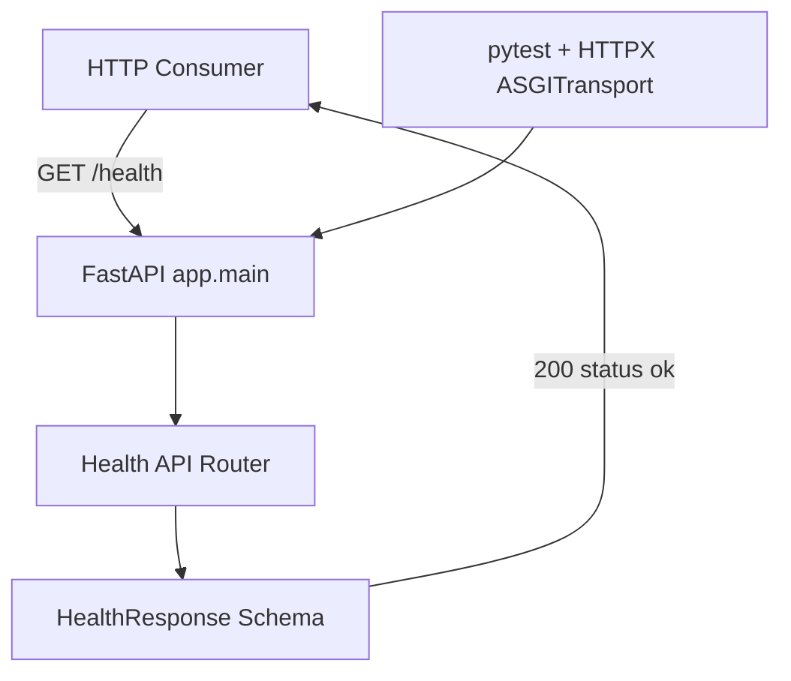

# Current Architecture

## Scope

Phase 1 exposes one operational endpoint and deliberately avoids speculative infrastructure. Database access, background work, AI integrations, RAG, agents, and tool calling are outside the current system boundary.

## Design Boundaries

- `app/main.py` creates and composes the web application.
- `app/api/` owns HTTP routing.
- `app/core/`, `app/models/`, `app/schemas/`, and `app/services/` are package boundaries reserved for functionality when it is actually introduced.
- Tests exercise the application through its ASGI interface rather than calling route functions directly.

Future architecture changes must be documented when their implementing code is introduced.
