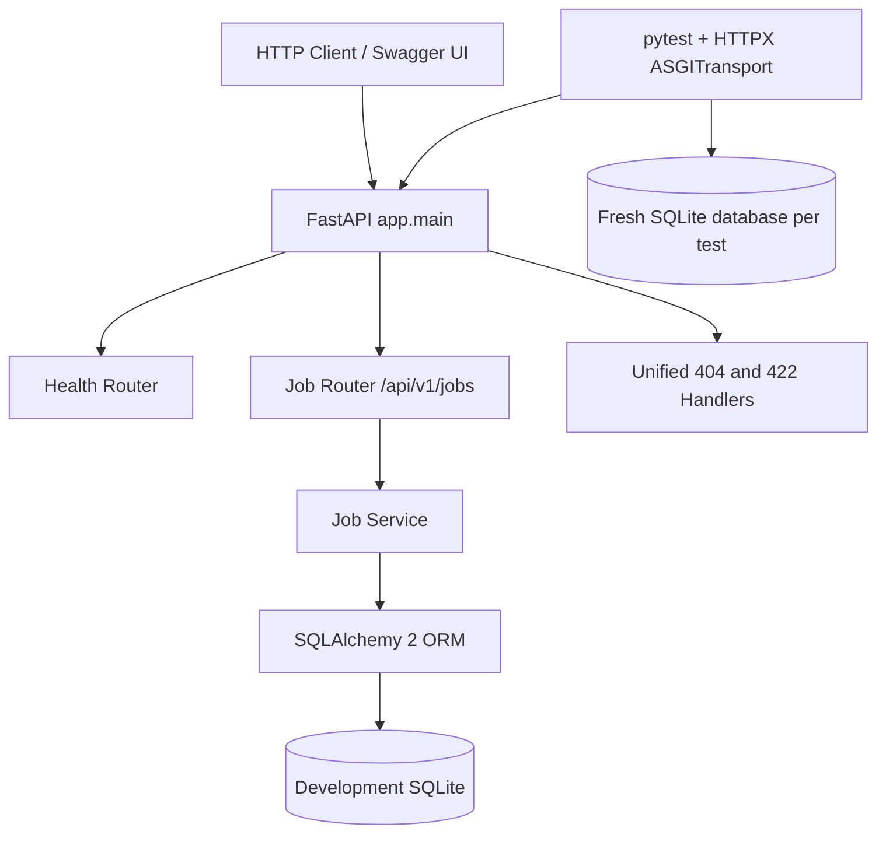

# Current Architecture

## Scope

Phase 2 adds one database-backed domain entity: `Job`. User accounts, resumes, applications, interviews, AI integrations, RAG, agents, tool calling, queues, and external services remain outside the current system boundary.

## Request Flow

1. FastAPI validates path, query, and body data against Pydantic contracts.
2. The Job router passes a request-scoped SQLAlchemy session to the service layer.
3. The service performs CRUD, filtering, ordering, and pagination through SQLAlchemy 2.x statements.
4. ORM entities are converted to explicit response schemas.
5. Domain not-found exceptions and request-validation failures use a consistent error envelope.

## Design Boundaries

- `app/main.py` composes the application and initializes metadata during the lifespan startup.
- `app/api/` owns HTTP semantics and parameter constraints.
- `app/services/job_service.py` owns the current business and persistence operations without additional repository/DAO layers.
- `app/models/job.py` owns the SQLAlchemy table and status enum.
- `app/schemas/` keeps request, response, list, and error contracts separate from ORM models.
- `app/core/` owns environment settings, session lifecycle, and exception handlers.
- `tests/conftest.py` replaces the runtime database dependency with a new temporary SQLite database for each test.

## Database Portability Boundary

The engine is created from `DATABASE_URL`. SQLite receives only its required `check_same_thread=False` option; other SQLAlchemy URLs are passed without SQLite-specific settings. MySQL still requires a selected driver, a running database, and real verification before it can be claimed as supported.
