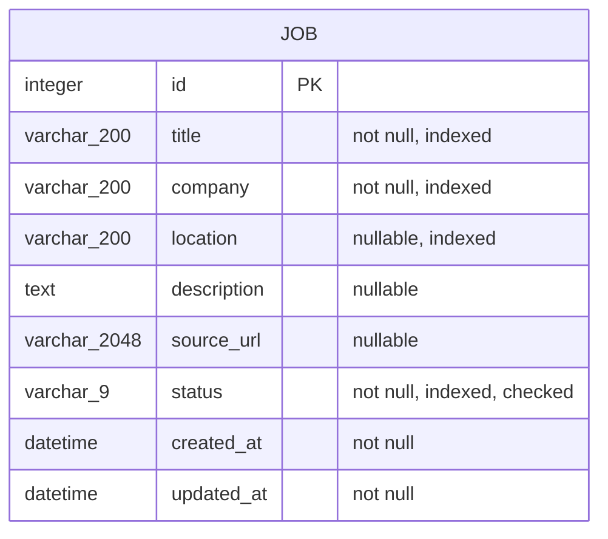

# Database Schema

## Implemented Entity

Phase 2 implements only the `jobs` table.

## Fields

| Field | SQLAlchemy / SQLite type | Nullable | Constraints and purpose |
|---|---|---:|---|
| `id` | `Integer` / `INTEGER` | No | Primary key |
| `title` | `String(200)` / `VARCHAR(200)` | No | Trimmed, non-blank, indexed |
| `company` | `String(200)` / `VARCHAR(200)` | No | Trimmed, non-blank, indexed |
| `location` | `String(200)` / `VARCHAR(200)` | Yes | Optional exact filter, indexed |
| `description` | `Text` / `TEXT` | Yes | Optional detail, API maximum 20,000 characters |
| `source_url` | `String(2048)` / `VARCHAR(2048)` | Yes | Optional URL validated by Pydantic |
| `status` | non-native `Enum` / `VARCHAR(9)` | No | Indexed and protected by `job_status` check constraint |
| `created_at` | `DateTime(timezone=True)` / `DATETIME` | No | UTC creation time |
| `updated_at` | `DateTime(timezone=True)` / `DATETIME` | No | Updated automatically when a row changes |

## Status Values

- `saved`: interesting role retained for review
- `applied`: an application was submitted
- `interview`: the process reached an interview stage
- `offer`: an offer was received
- `rejected`: the employer or process rejected the application
- `closed`: the opportunity ended without being represented accurately as a rejection

`closed` is kept because expired listings and withdrawn applications are common and semantically different from `rejected`.

## Initialization Strategy

`Base.metadata.create_all()` is sufficient for the current single-table MVP and avoids introducing an unused migration workflow. Alembic becomes appropriate when an existing schema must evolve across environments.

## Verified Database DDL

The Phase 2 SQLite database created a primary key, the named `job_status` check constraint, and indexes on `title`, `company`, `location`, and `status`. The evidence image at [`docs/images/database-er-diagram.png`](../images/database-er-diagram.png) was produced from this verified schema.
