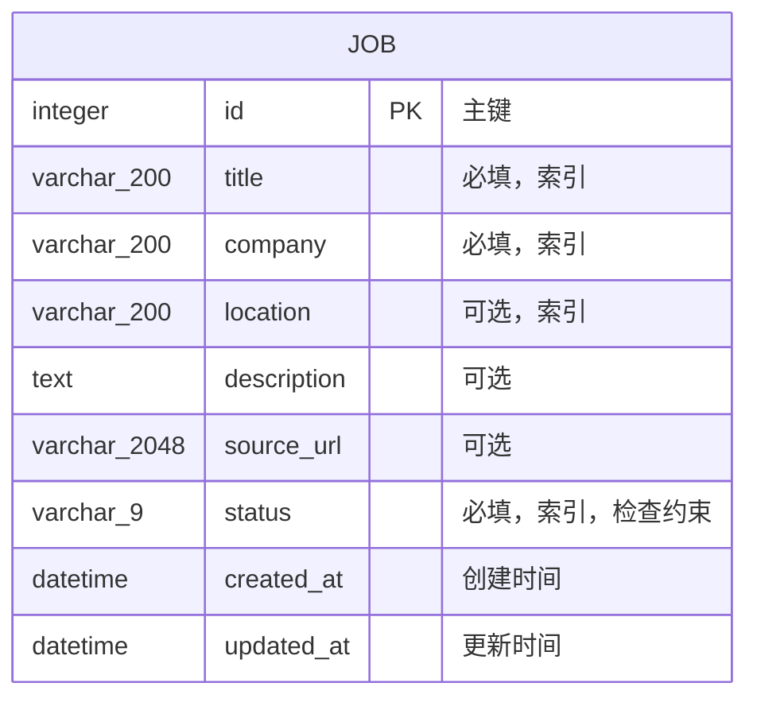

# 数据库结构

## 当前实体

系统当前实现 `jobs` 表，用于保存岗位基本信息和求职状态。

## 字段说明

| 字段 | SQLAlchemy / SQLite 类型 | 可为空 | 约束与用途 |
|---|---|---:|---|
| `id` | `Integer` / `INTEGER` | 否 | 主键 |
| `title` | `String(200)` / `VARCHAR(200)` | 否 | 去除首尾空格后不能为空，建立索引 |
| `company` | `String(200)` / `VARCHAR(200)` | 否 | 去除首尾空格后不能为空，建立索引 |
| `location` | `String(200)` / `VARCHAR(200)` | 是 | 支持地点筛选，建立索引 |
| `description` | `Text` / `TEXT` | 是 | 职位描述，API 最大长度 20,000 字符 |
| `source_url` | `String(2048)` / `VARCHAR(2048)` | 是 | 经过 Pydantic URL 校验的来源链接 |
| `status` | 非原生 `Enum` / `VARCHAR(9)` | 否 | 建立索引，并受 `job_status` 检查约束保护 |
| `created_at` | `DateTime(timezone=True)` / `DATETIME` | 否 | UTC 创建时间 |
| `updated_at` | `DateTime(timezone=True)` / `DATETIME` | 否 | 数据变化时自动更新 |

## 状态枚举

- `saved`：已收藏，等待进一步评估
- `applied`：已提交申请
- `interview`：已进入面试流程
- `offer`：已获得录用意向
- `rejected`：本次申请未通过
- `closed`：岗位过期、主动结束或其他终止情况

`closed` 用于表达岗位过期或主动结束等情况，与 `rejected` 保持业务语义区分。

## 初始化策略

当前只有一个数据表，使用 `Base.metadata.create_all()` 完成结构初始化，保持本地启动流程简洁。当持久化环境需要连续的 Schema 版本演进时，将引入 Alembic 管理迁移。

## SQLite DDL 核验

本地 SQLite 数据库已生成主键、`job_status` 检查约束，以及 `title`、`company`、`location`、`status` 索引。结构截图见 [`database-er-diagram.png`](../images/database-er-diagram.png)。
